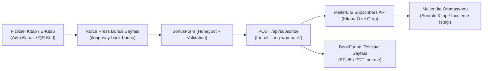

# Valice Press — Bonus Sahne & Lead Magnet Mimari Rehberi

> **Belge Sahibi:** Platform Mühendisliği & Büyüme (Growth) Ekibi  
> **Hedef Kitle:** Başka kitaplar veya yeni seriler için sitede bonus sahne / lead magnet altyapısı kuracak mühendisler ve yapay zeka ajanları.  
> **Durum:** AKTİF (Active)  
> **Son Güncelleme:** 2026-09-30  

---

## 1. Mimari Amaç ve Temel Felsefe

Amazon KDP veya geniş dağıtım (Wide) kanallarından kitap satın alan müşteriler **Amazon'un müşterisidir**, yayınevinin değil. Bir okuyucunun doğrudan Valice Press ile bağ kurmasını ve yeni çıkacak kitaplardan haberdar olmasını sağlayan **tek köprü**, fiziksel veya dijital kitabın sonuna (back matter) veya arka kapağına basılan **Bonus Sahne QR Kodu ve Kısa Linkidir**.

Okuyucu bu bağlantıyı açtığında:
1. Kitabın atmosferine uygun, dikkat dağıtmayan **Sinematik Kabuk (Cinematic Shell)** üzerinde özel bir bonus sahne sayfasına ulaşır.
2. E-posta adresini girer.
3. Arka uçta e-posta adresi **MailerLite** üzerindeki ilgili kitabın grubuna kaydedilir.
4. Okuyucu beklemeden ve doğrudan **BookFunnel** teslimat sayfasına yönlendirilir (EPUB / PDF formatlarını kendi e-okuyucusuna veya telefonuna tek tıkla indirir).
5. MailerLite üzerinden birkaç gün sonra otomatik olarak bir sonraki kitabın tanıtımı (*read-through onboarding*) başlar.



---

## 2. Neden Resend Değil de MailerLite?

Sitede iki ayrı e-posta sağlayıcısı bulunur:
* **Resend Audiences (`/api/newsletter`):** Genel site bülteni, hesap bildirimleri, doğrudan satın alım teslimatları (`order-ready`) gibi işlem (transactional) e-postaları için kullanılır.
* **MailerLite (`/api/subscribe`):** Kurgu kitap serileri, okur segmentasyonu ve serideki kitaplar arası satış otomasyonları (*read-through funnels*) için izole edilmiştir. 
* **BookFunnel:** Telifli e-kitap dosyalarını (EPUB/PDF) okuyucunun Kindle, Kobo, Apple Books cihazına sorunsuz aktaran ve teknik destek veren özel teslimat servisidir.

---

## 3. Mimari Bileşenler ve Dosya Haritası

Bonus sahne altyapısı aşağıdaki dosyalardan oluşur:

| Dosya | Görev | Çalışma Zamanı |
|---|---|---|
| `src/app/<slug>-bonus/page.tsx` | Bonus açılış sayfası (Landing Page). | Sunucu Bileşeni (SSG/Static HTML) |
| `src/components/bonus/bonus-cover.tsx` | Kapak görselini arka plana yumuşakça eriten (masking) bileşen. | İstemci/Sunucu uyumlu |
| `src/components/bonus/bonus-form.tsx` | E-posta formu, honeypot spam koruması ve yönlendirme mantığı. | İstemci Bileşeni (`"use client"`) |
| `src/app/api/subscribe/route.ts` | MailerLite abonelik ve funnel yönlendirme uç noktası. | Edge/Serverless Route Handler |
| `src/app/api/subscribe/route.test.ts` | Funnel eşlemelerini ve hata senaryolarını test eden birim testleri. | Vitest |
| `public/images/bonus/<slug>-cover.webp` | Optimize edilmiş kapak görseli (WebP formatında). | Statik Varlık |

---

## 4. Değişmez Mimari Kurallar (Non-Negotiable Rules)

Yeni bir bonus sayfası ekleyen kişi veya ajan şu 5 kurala **kesinlikle uymalıdır**:

### Kural 1: İki Sonucun Ayrılması (`ok` vs `deliver`)
MailerLite servisinde geçici bir kesinti olsa, kota dolsa (429) veya ağ hatası yaşansa dahi, gerçek bir e-posta giren okuyucu **asla eli boş döndürülmez**.
* `ok: false, deliver: true` döner: Sayfa okuyucuya bonus indirme linkini açar (`BookFunnel`), ancak sunucu hatayı sessizce loglar. Okuyucuya "Kaydoldunuz" yalanı söylenmez ama vadedilen dosya da engellenmez.

### Kural 2: Teslimat Linki Yoksa Form Gösterilmez (Unset Safe State)
`NEXT_PUBLIC_BOOKFUNNEL_URL_<SLUG>` ortam değişkeni henüz build ortamına girilmemişse, sayfa **formu render etmez**. Bunun yerine okuyucuya dürüstçe *"The download opens soon"* mesajı gösterilir. Yerine getiremeyeceğimiz bir söz için e-posta toplanamaz.

### Kural 3: Sunucu Tarafı Güvenli İzin Listesi (Funnel Allowlist)
İstemci (browser) rasgele bir MailerLite grup ID'si gönderemez. Form yalnızca `funnel="<slug>"` adını gönderir. `src/app/api/subscribe/route.ts` içindeki `FUNNEL_GROUP_ENV` haritası bunu sunucu tarafındaki güvenli ortam değişkenine çevirir. Tanınmayan veya boş olan funnel'lar varsayılan `MAILERLITE_GROUP_ID` grubuna düşer.

### Kural 4: Statik Önceden Derleme (SSG) ve Ortam Değişkenleri
Sayfa `statically prerendered` (○) olduğundan, `NEXT_PUBLIC_*` değişkenleri **BUILD (derleme) anında** HTML içine gömülür. Canlı sunucuda değişken değiştirilirse sitenin **yeniden derlenip deploy edilmesi (redeploy)** şarttır.

### Kural 5: Her Kitaba Ayrı MailerLite Grubu
Bir serideki her kitap için MailerLite'ta **ayrı grup** açılmalıdır. MailerLite tekil e-postaya göre fatura kestiğinden ek maliyet oluşturmaz; ancak 1. kitabı bitirene 2. kitabı satma otomasyonu için bu ayrım şarttır.

---

## 5. Adım Adım Yeni Bir Kitap İçin Bonus Sahne Kurulumu

Yeni bir kitap için (örneğin *The Whispering Pines* isimli Kitap 3 / slug: `whispering-pines`) altyapı kurarken aşağıdaki 7 adımı sırasıyla uygulayın:

### Adım 1: MailerLite ve BookFunnel Hazırlığı
1. **MailerLite:**
   * **Subscribers > Groups > Create group** yolunu izleyin.
   * Grup adı formatı: `<Seri Adı> - Book <No> (<Kitap Başlığı>)` (Örn: `Larkspur Lake - Book 3 (The Whispering Pines)`).
   * Grubun içine girip URL'deki veya detaydaki **Grup ID'sini** (ör. `123456789012345678`) kopyalayın.
2. **BookFunnel:**
   * Bonus sahnenin EPUB ve PDF dosyalarını BookFunnel hesabınıza yükleyin.
   * Dağıtım sayfası oluşturup teslimat bağlantısını alın (Örn: `https://dl.bookfunnel.com/abcdefghij`).

---

### Adım 2: Kapak Görselini Ekleyin
Kapağın onaylanmış e-kitap ön kapağını `1000x1600` boyutlarında WebP formatına çevirip projeye ekleyin:
```bash
public/images/bonus/the-whispering-pines-cover.webp
```

---

### Adım 3: Arka Uç (Backend) Eşlemesini Tanımlayın
[src/app/api/subscribe/route.ts](file:///home/emre/Downloads/Valice-Press-Site/src/app/api/subscribe/route.ts) dosyasındaki `FUNNEL_GROUP_ENV` haritasına yeni kitabın funnel adını ve ortam değişkenini ekleyin:

```ts
// src/app/api/subscribe/route.ts
const FUNNEL_GROUP_ENV = new Map<string, string>([
  ["long-way-back", "MAILERLITE_GROUP_ID_LONG_WAY_BACK"],
  ["whispering-pines", "MAILERLITE_GROUP_ID_WHISPERING_PINES"], // <-- YENİ EKLENEN
]);
```

---

### Adım 4: Birim Testleri Güncelleyin
[src/app/api/subscribe/route.test.ts](file:///home/emre/Downloads/Valice-Press-Site/src/app/api/subscribe/route.test.ts) dosyasına temizleme ve eşleme testini ekleyin:

```ts
afterEach(() => {
  delete process.env.MAILERLITE_GROUP_ID_LONG_WAY_BACK;
  delete process.env.MAILERLITE_GROUP_ID_WHISPERING_PINES; // <-- Temizleme kuralı
  vi.unstubAllGlobals();
  vi.restoreAllMocks();
});
```
Ve testleri çalıştırın:
```bash
npm test src/app/api/subscribe/route.test.ts
```

---

### Adım 5: Yeni Bonus Sayfasını Oluşturun
`src/app/<slug>-bonus/page.tsx` dosyasını oluşturun (örneğin `src/app/whispering-pines-bonus/page.tsx`):

```tsx
import Link from "next/link";
import { BonusCover } from "@/components/bonus/bonus-cover";
import { BonusForm } from "@/components/bonus/bonus-form";
import { CinematicHeader } from "@/components/home/cinematic-header";
import { HomeFooter } from "@/components/home/home-footer";
import { buildPageMetadata } from "@/lib/metadata";

const COVER = {
  src: "/images/bonus/the-whispering-pines-cover.webp",
  width: 1000,
  height: 1600,
  alt: "The Whispering Pines — Book Three of The Larkspur Lake Novels by Harper Hayes",
} as const;

export const metadata = buildPageMetadata({
  title: "The Cabin Key — A Bonus Scene from The Whispering Pines",
  description: "A free exclusive bonus scene from The Whispering Pines by Harper Hayes.",
  path: "/whispering-pines-bonus",
  image: {
    url: COVER.src,
    alt: COVER.alt,
    width: COVER.width,
    height: COVER.height,
  },
});

const BENEFITS = [
  "An exclusive character perspective scene",
  "Author's historical notes on the setting",
  "EPUB and PDF editions",
] as const;

export default function WhisperingPinesBonusPage() {
  const bookfunnelUrl =
    process.env.NEXT_PUBLIC_BOOKFUNNEL_URL_WHISPERING_PINES?.trim() || null;

  return (
    <div
      className="cinematic-root"
      style={
        {
          "--bonus-accent": "#d6b266",
          "--bonus-accent-hi": "#f7dea0",
        } as React.CSSProperties
      }
    >
      <CinematicHeader />

      <main id="main-content" className="relative z-10">
        <div
          aria-hidden="true"
          className="pointer-events-none absolute inset-0 -z-10 bg-[radial-gradient(58%_42%_at_28%_30%,rgba(200,161,94,0.10),transparent_72%)]"
        />

        <div className="mx-auto max-w-[1320px] px-4 pb-20 pt-10 sm:px-6 sm:pb-24 sm:pt-16 lg:pt-20">
          <div className="mx-auto grid w-full max-w-5xl gap-y-6 lg:grid-cols-[minmax(0,0.78fr)_minmax(0,1fr)] lg:items-center lg:gap-x-14 lg:gap-y-0">
            {/* Kicker */}
            <p className="order-1 text-[0.66rem] font-medium uppercase tracking-[0.26em] text-[var(--bonus-accent)] lg:order-none lg:col-start-2 lg:row-start-1 lg:mb-3">
              Larkspur Lake &middot; Exclusive Bonus
            </p>

            {/* Kapak Görseli */}
            <div className="order-2 flex justify-center lg:order-none lg:col-start-1 lg:row-span-2 lg:row-start-1">
              <BonusCover
                src={COVER.src}
                alt={COVER.alt}
                width={COVER.width}
                height={COVER.height}
                priority
                sizes="(min-width: 1024px) 300px, (min-width: 640px) 190px, 42vw"
                className="h-auto w-[min(42vw,152px)] sm:w-[190px] lg:w-full lg:max-w-[300px]"
              />
            </div>

            {/* Başlık ve Form */}
            <div className="order-3 lg:order-none lg:col-start-2 lg:row-start-2">
              <h1
                style={{ fontFamily: "var(--font-serif), Georgia, serif" }}
                className="text-[2.05rem] leading-[1.08] tracking-[-0.01em] text-fg-hi sm:text-[2.55rem] lg:text-[3rem]"
              >
                The Cabin Key
              </h1>

              <p
                style={{ fontFamily: "var(--font-serif), Georgia, serif" }}
                className="mt-2 text-[1.02rem] italic text-fg-soft sm:text-[1.1rem]"
              >
                A Bonus Scene from The Whispering Pines
              </p>

              <p className="mt-4 text-[0.95rem] leading-relaxed text-fg-soft">
                Kısa açıklama paragrafı.
              </p>

              <div className="mt-6 border-t border-white/[0.07] pt-5">
                <p className="text-[0.66rem] font-semibold uppercase tracking-[0.22em] text-[var(--bonus-accent)]">
                  Free bonus
                </p>
                <ul className="mt-3 space-y-2">
                  {BENEFITS.map((benefit) => (
                    <li
                      key={benefit}
                      className="flex items-start gap-2.5 text-[0.9rem] leading-snug text-fg-mid"
                    >
                      <span
                        aria-hidden="true"
                        className="mt-[0.45rem] h-1 w-1 shrink-0 rounded-full bg-[var(--bonus-accent)]"
                      />
                      {benefit}
                    </li>
                  ))}
                </ul>
              </div>

              {bookfunnelUrl ? (
                <>
                  <BonusForm
                    bookfunnelUrl={bookfunnelUrl}
                    funnel="whispering-pines"
                  />
                  <p className="mt-4 text-[0.72rem] leading-relaxed text-fg-fade">
                    We&rsquo;ll email you occasionally about the Larkspur Lake books. Unsubscribe any time. See our{" "}
                    <Link href="/privacy" className="underline decoration-white/25 underline-offset-2 hover:text-fg-soft">
                      privacy policy
                    </Link>.
                  </p>
                </>
              ) : (
                <div role="status" className="mt-7 rounded-lg border border-white/[0.08] bg-white/[0.03] px-5 py-4">
                  <p className="text-[0.95rem] text-fg-hi">
                    The download for <em>The Cabin Key</em> opens soon.
                  </p>
                  <p className="mt-1.5 text-[0.85rem] leading-relaxed text-fg-mid">
                    Please check back shortly.
                  </p>
                </div>
              )}
            </div>
          </div>
        </div>
      </main>

      <HomeFooter />
    </div>
  );
}
```

---

### Adım 6: Ortam Değişkenlerini Tanımlayın
1. **`.env.example` dosyasını güncelleyin:**
   ```env
   # /whispering-pines-bonus — THE CABIN KEY lead magnet
   MAILERLITE_GROUP_ID_WHISPERING_PINES=
   NEXT_PUBLIC_BOOKFUNNEL_URL_WHISPERING_PINES=
   ```
2. **Yerel test için `.env.local` dosyasına ekleyin:**
   ```env
   MAILERLITE_GROUP_ID_WHISPERING_PINES="<grup-id>"
   NEXT_PUBLIC_BOOKFUNNEL_URL_WHISPERING_PINES="https://dl.bookfunnel.com/..."
   ```
3. **Vercel Panosuna Ekleyin (KRİTİK ADIM):**
   Vercel projesinde `Settings > Environment Variables` bölümünden:
   * `MAILERLITE_GROUP_ID_WHISPERING_PINES` (Sensitive, Production + Preview)
   * `NEXT_PUBLIC_BOOKFUNNEL_URL_WHISPERING_PINES` (Production + Preview)
   değişkenlerini ekleyin.
   > **Unutmayın:** `NEXT_PUBLIC_*` değişkeninin derleme çıktısına işlemesi için Vercel'de **yeniden deploy (Redeploy)** tetikleyin.

---

### Adım 7: Doğrulama ve Test Kontrol Listesi

Yeni bonus sayfasını yayına almadan önce şu 5 kontrolü tamamlayın:

- [ ] **Yerel Test:** `npm test` komutuyla `route.test.ts` testlerinin tümünün yeşil geçtiğinden emin olun.
- [ ] **Derleme Kontrolü:** `npm run build` komutunun hatasız tamamlandığını ve rotanın `○ (Static)` olarak derlendiğini doğrulayın.
- [ ] **Honeypot Koruması:** `website` alanı dolu bir bot isteği gönderildiğinde 200 dönüp MailerLite'a gitmediğini kontrol edin.
- [ ] **Canlı E-Posta Akışı:** Canlı sayfaya gerçek bir e-posta girip:
  1. MailerLite panelinde ilgili kitaba ait grubun sayısının 1 arttığını,
  2. Tarayıcının 900ms sonra BookFunnel indirme ekranına başarıyla yönlendiğini doğrulayın.
- [ ] **Basılı Adres Toleransı:** Eğer kitap içinde QR kodun altına düz metin link yazıldıysa (`valicepress.com/Whispering-Pines-Bonus`), kullanıcı harfleri büyük yazsa dahi 404 almaması için gerekirse `src/lib/printed-address.ts` içine ekleme yapın.

---

## 6. Third funnel: `/weather-permitting-bonus` (THE SECOND CHAIR) — 2026-10-01

Book: *Weather Permitting* (Bristlecone Emergency, Book 1, Quinn Gallagher). Bonus: THE SECOND CHAIR (extended epilogue, EPUB + PDF on BookFunnel).

| Item | Value |
|---|---|
| Page | `src/app/weather-permitting-bonus/page.tsx` (the /long-way-back-bonus pattern; `funnel="weather-permitting"`) |
| Cover | `public/images/bonus/the-second-chair-cover.webp` (1000 x 1500) |
| MailerLite group | `MAILERLITE_GROUP_ID_WEATHER_PERMITTING` = `200036789993342036` ("Weather Permitting - Reader Magnet") |
| Token | optional `MAILERLITE_API_TOKEN_WEATHER_PERMITTING`, else `MAILERLITE_API_TOKEN` |
| BookFunnel | `NEXT_PUBLIC_BOOKFUNNEL_URL_WEATHER_PERMITTING` (simple download page; build-time) |
| Printed address | `valicepress.com/weather-permitting-bonus` (paperback + Kindle back matter); case-forgiven in `src/lib/printed-address.ts` |

Rule changes introduced with this funnel (all covered by `route.test.ts`):
1. **Strict funnel.** A funnel can be marked `strict`: its readers are never filed under the default `/bonus` (Larkspur Lake) group. An unset group answers 503 and calls nobody.
2. **Per-funnel token** (optional), falling back to the shared token.
3. **`X-Version: 2026-10-01`** pins the MailerLite API behaviour.
4. **`MAILERLITE_API_BASE`** — honoured only for loopback hosts, so a local production build can be tested end to end against a mock (no real list, no email).
5. **Form fallback.** After a successful submit the form keeps an "Open my bonus" button and a note on what to do if BookFunnel is not answering; "You're in" is shown only when MailerLite confirmed the subscription (`ok: true`).
